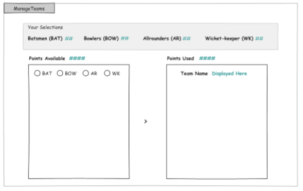
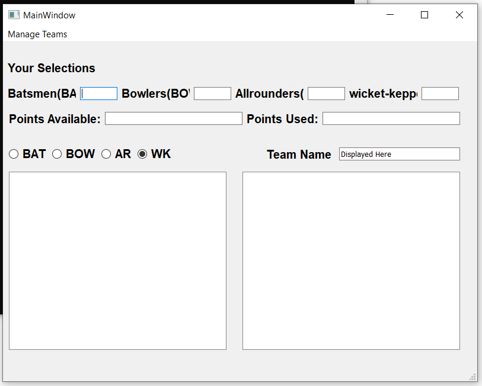
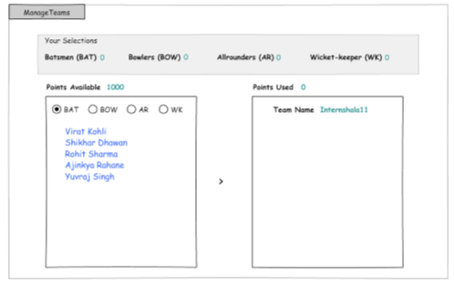
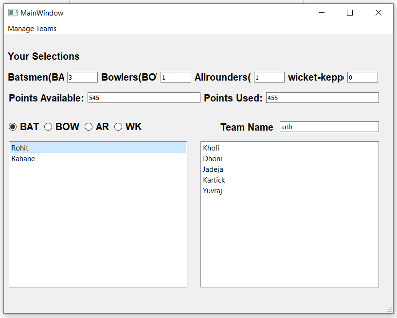
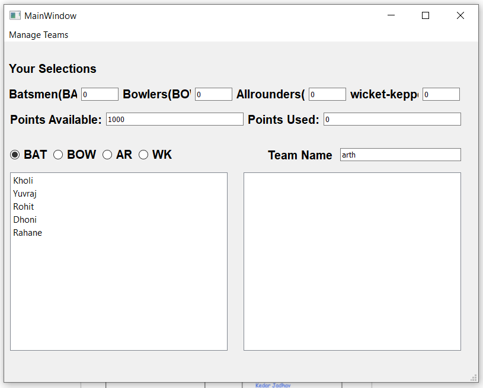
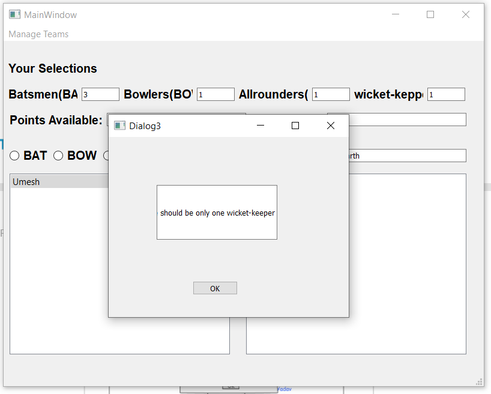
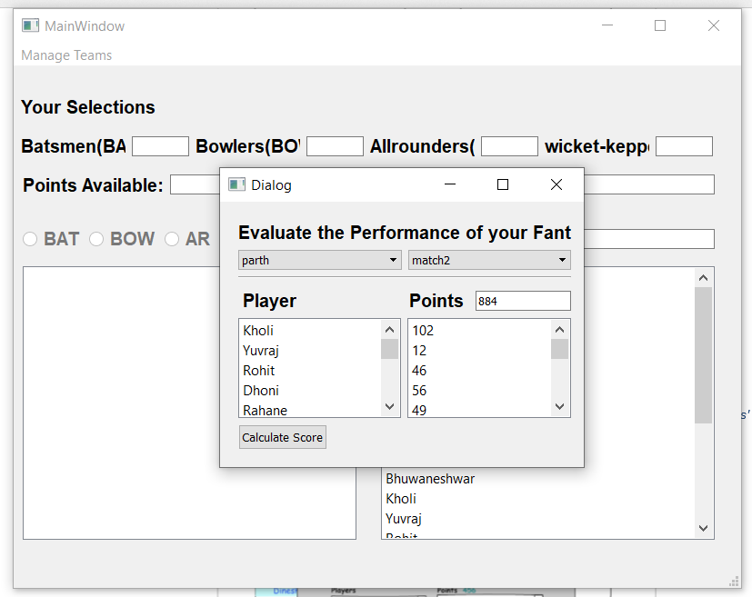
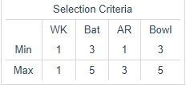

# cricket_game
**Installment Requriements** 
For running this game you need python 3.5 or higer version installed on your system.
For accessing the database you need have SQLite 3 or higher version in your database.

**How to play this game** 
It is an online game where you create a virtual team of real cricket players and score points  depending on how your chosen players perform in real life matches. To win a tournament,  you must try and get the maximum points and the No. 1 rank amongst other participants.  Here's how a Fantasy Cricket game may look like. 

  
1 - Opening screen of the application. You can see the players of each category by selecting the category. To  begin with, the selection is disabled until a new team is created from the Manage Teams menu. A pop up asking  the name of the team appears. 
 
  
2 - The toolbar menu options which allow you to create a new team, open an existing team, save your team and  finally evaluate the score of a saved team.
 
  
 3 - After clicking New Team, the left box is populated with player names. As you select a different category, the  corresponding list of players is displayed. 

 
4 - On double-clicking each player name, the right box gets populated. Points available and used are displayed  accordingly. 

 
5 - Message if the game logic is not followed.

 
6 - Pop-up on clicking Evaluate Score. You can select your team here and the match for which the players'  performance is compared.  

 
7 - The final score for your fantasy team based on the match selected.

**Rules of this game** 

Batting   
● 1 point for 2 runs scored 
● Additional 5 points for half century   
● Additional 10 points for century 
● 2 points for strike rate (runs/balls faced) of 80-100   
● Additional 4 points for strike rate>100 
● 1 point for hitting a boundary (four) and 2 points for over boundary (six) 

Bowling  
● 10 points for each wicket   
● Additional 5 points for three wickets per innings   
● Additional 10 points for 5 wickets or more in innings  
● 4 points for economy rate (runs given per over) between 3.5 and 4.5  
● 7  points for economy rate between 2 and 3.5 
● 10 points for economy rate less than 2 

Fielding  
● 10 points each for catch/stumping/run out 

**How to select the team** 

 

